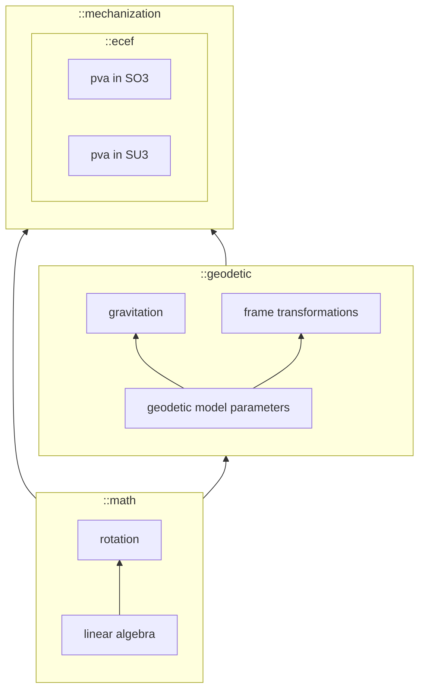

# Organization

Algorithms are implemented in C++ as a header-only library with the only dependancy being [Eigen](https://eigen.tuxfamily.org/index.php?title=Main_Page). Functions are templated, as necessary, to emphasize dependency on specific models (e.g. geodetic). Bindings are provided both for python ([nanobind](https://nanobind.readthedocs.io/)) and MATLAB ([clib](https://www.mathworks.com/help/matlab/use-prebuilt-matlab-interface-to-c-library.html)).

Folder contents:

- ``Ennui\`` : main software, C/C++
- ``tests\`` : unit tests for the main software
- ``python\`` : python binding (using [nanobind](https://nanobind.readthedocs.io/))
- ``matlab\`` : MATLAB binding (using
  [clib](https://www.mathworks.com/help/matlab/use-prebuilt-matlab-interface-to-c-library.html)).
- ``scripts\`` : utility scripts for building and testing. Run from root folder.
- ``docs\`` : content for generating the [static
  website](http://mrwalke.cee-gitlab.lan/ennui/) through the CI/CD pipeline
  (``../.gitlab-ci.yml``).

## Namespaces
Namespace and template usage here is intended to generalize models across multiple use-cases and implementations.  For example, gravitation models are required for state propagation using inertial sensors. Equations to compute gravitation are parameterized by a geodetic model (e.g. WGS84[@NGA-STND-0036]). For a particular use-case, the mechanization reference frame (e.g. ECEF) will also inform selection of a gravitation equation.

## Recommended reading:

* Geodetic model parameters: NGA-STND-0036[@NGA-STND-0036]
* Frame transformations: Misra & Per Enge, GPS Textbook[@misra_global_2001]
* Navigation equations: Groves, Principles of GNSS Textbook[@groves_principles_2013]

\bibliography
